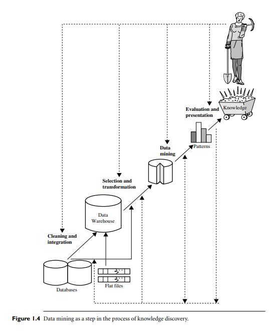

# CHAPTER 1. INTRODUCTION 

### Motivation for Data Mining 

- There's a lot of data available, but it's hard to make sense of it without the right tools.
- Large amounts of stored data often go unused, leading to missed opportunities for valuable insights.
- Decision-makers sometimes rely on intuition instead of the data because they lack tools to extract useful information.
- Expert systems were created to help, but they require manual input, which is expensive, slow, and error-prone.
- To bridge the gap between data and information, data mining tools are needed to turn unused data into valuable knowledge.

### What is Data Mining?

- **Definition**: Data mining refers to the process of discovering interesting patterns and knowledge from large amounts of data.
- **Alternative Names**: It is sometimes called knowledge discovery from data (KDD), knowledge extraction, or data pattern analysis.
- **Steps in Knowledge Discovery Process**:
  1. **Data Cleaning**: Removing errors and inconsistencies.
  2. **Data Integration**: Combining data from multiple sources.
  3. **Data Selection**: Retrieving relevant data for analysis.
  4. **Data Transformation**: Converting data into a suitable format for mining.
  5. **Data Mining**: Applying methods to find patterns in the data.
  6. **Pattern Evaluation**: Identifying useful and interesting patterns.
  7. **Knowledge Presentation**: Presenting the discovered patterns to users through visualization.

- **Data Sources**: Can come from databases, data warehouses, the Web, or real-time data streams.
- **Common Usage**: While data mining is technically one step in the larger knowledge discovery process, the term is often used to describe the entire process of extracting knowledge from data.

### What kinds of Data can be mined?

_1. **Database Data**:_
- Data stored in a **database** (managed by a DBMS) which includes:
  - Tables with rows (records) and columns (attributes).
  - Queries can retrieve subsets of data using operations like join, selection, and projection.
  - Data mining can find patterns, trends, and deviations (e.g., predicting customer behavior).

_2. **Data Warehouses**:_
- A **data warehouse** is a centralized storage system that consolidates data from multiple sources.
  - Data is often summarized (e.g., sales per region).
  - Used for historical analysis and decision-making.

_3. **Transactional Data**:_
- **Transactional databases** store records of transactions (e.g., customer purchases or web clicks).
  - Each transaction has a unique ID and a list of items involved.
  - Additional tables may store related info like salesperson or branch details.

_4. **Other Types of Data**:_
- **Time-related/Sequence Data**: Includes historical data, stock exchange data, etc.
- **Data Streams**: Continuously generated data (e.g., video surveillance or sensor data).
- **Spatial Data**: Maps and geographic information.
- **Text, Hypertext, and Multimedia Data**: Includes documents, images, videos, and audio.
- **Graph and Network Data**: Social networks, information networks, and web data.

_5. **Challenges in Mining Complex Data**:_
- **Complex Structures**: Handling data with sequences, graphs, and networks.
- **Multiple Data Types**: Mining web data may involve text, multimedia, and graph data all at once.
- **Advanced Techniques**: Mining these types of data requires more advanced methods.

$\rightarrow$ Data mining can be applied to a wide variety of data sources, from databases and data warehouses to complex, multimedia, and networked data. Each type presents its own challenges and opportunities.

### What kinds of patterns can be mined?

_1. **Class/Concept Description**:_
- **Characterization**: Summarizes the general characteristics of a target class (e.g., "high sales items").
- **Discrimination**: Compares characteristics between target and contrasting classes (e.g., "big spenders" vs. "budget spenders").

_2. **Frequent Patterns, Associations, and Correlations**:_
- **Frequent Patterns**: Patterns that appear often (e.g., "milk and bread bought together").
- **Associations**: Discover relationships between items (e.g., "if a laptop is bought, a memory card is often bought too").
- **Correlations**: Shows how items are related across data.

_3. **Classification and Regression (Predictive Analysis)**:_
- **Classification**: Builds a model to classify data into predefined categories (e.g., predicting customer credit risk).
- **Regression**: Predicts continuous values (e.g., predicting sales amount based on customer data).

_4. **Clustering Analysis**:_
- Groups data objects that share similarities without predefined labels (e.g., grouping customers based on buying behavior).

_5. **Outlier Analysis**:_
- Detects data points that do not fit the general pattern (e.g., identifying fraudulent transactions).

_6. **Interestingness of Patterns**:_
- Patterns are interesting if they are:
  - Easy to understand.
  - Valid on new data.
  - Useful and novel.
- **Objective Measures**: Include support, confidence, accuracy, and coverage.
- **Subjective Measures**: Based on user beliefs, such as unexpected or actionable patterns.

$\rightarrow$ Data mining systems generate various patterns, but not all are interesting. Measures of interestingness help filter and focus the search for valuable insights.

### Which techonologies are used?

_1. **Statistics**:_
- **Role**: Helps in data analysis, summarization, and modeling of data behavior.
- **Usage**: 
  - Builds statistical models to describe data (e.g., for classification or prediction).
  - Verifies data mining results using statistical hypothesis testing.
- **Challenges**: Scaling statistical methods for large data sets and real-time applications.

_2. **Machine Learning**:_
- **Supervised Learning**: Also known as classification; uses labeled training data to build models.
- **Unsupervised Learning**: Also known as clustering; finds patterns in unlabeled data.
- **Semi-supervised Learning**: Uses both labeled and unlabeled data to improve model performance.
- **Active Learning**: Involves users in the learning process by requesting labels for certain examples.
- **Difference with Data Mining**: Focuses more on model accuracy, while data mining also emphasizes scalability and efficiency for large datasets.

_3. **Database Systems and Data Warehouses**:_
- **Database Systems**: Provide highly scalable technologies for data storage, query processing, and optimization.
- **Data Warehousing**: Integrates data from multiple sources and stores it in a multidimensional structure for OLAP and multidimensional data mining.

_4. **Information Retrieval (IR)**:_
- **Role**: Focuses on searching for information within unstructured data (e.g., text documents).
- **Methods**: Uses probabilistic models to measure document similarity based on keywords.
- **Integration with Data Mining**: Techniques from IR are increasingly combined with text mining and multimedia data mining to analyze large volumes of unstructured data, such as those found on the Web.

$\rightarrow$ Data mining leverages a variety of technologies, including statistics, machine learning, database systems, and information retrieval, to extract meaningful patterns from data. These technologies contribute to the efficiency, accuracy, and scalability of data mining methods across different types of data.

### Which kinds of applications are targeted?

_Data mining is applied across many domains. Two major application areas are **business intelligence** and **web search engines**._

_1. **Business Intelligence (BI)**:_
- **Purpose**: Helps businesses understand customers, markets, competitors, and resources.
- **Technologies Involved**:
  - **Reporting and OLAP**: Use data warehousing and multidimensional data mining.
  - **Predictive Analytics**: Employs classification and prediction techniques for market analysis and sales forecasting.
  - **Clustering**: Groups customers to improve customer relationship management.
  - **Characterization Mining**: Provides insights into customer behavior for tailored marketing strategies.

_2. **Web Search Engines**:_
- **Purpose**: Search engines retrieve and rank information from the Web (e.g., web pages, images).
- **Technologies Involved**:
  - **Crawling**: Decides which pages to crawl and how frequently.
  - **Indexing**: Determines which pages to index and the depth of indexing.
  - **Searching**: Ranks pages, manages advertisements, and personalizes results using context-awareness.
- **Challenges**:
  - Handling large-scale data using distributed systems (e.g., computer clouds).
  - Real-time processing for online queries.
  - Incremental model updates to handle evolving data streams.
  - Context-aware query recommendations for rare queries, which creates skewed data challenges.

### Major issues in Data Mining 

_1. **Mining Methodology**:_
  - Developing new methods for different types of knowledge discovery (e.g., classification, clustering).
  - **Multidimensional Data Mining**: Exploring data across various dimensions for deeper insights.
  - Integrating techniques from other fields like natural language processing or software engineering.
  - Handling **uncertainty, noise**, and **incomplete data**.
  - **Pattern Evaluation**: Using user-defined measures to assess the interestingness of patterns.

_2. **User Interaction**:_
  - **Interactive Mining**: Users should be able to interact with the system dynamically, refining their searches and exploring the data.
  - **Background Knowledge**: Incorporating domain knowledge to guide the mining process.
  - **Data Mining Query Languages**: High-level languages that allow users to define custom mining tasks.
  - **Visualization**: Presenting results in a clear, understandable way.

_3. **Efficiency and Scalability**:_
  - **Efficiency**: Algorithms need to be fast and scalable to handle large datasets and dynamic data streams.
  - **Parallel and Distributed Mining**: Using multiple machines to process large datasets simultaneously.
  - **Incremental Mining**: Updating models incrementally as new data arrives, without reprocessing everything from scratch.

_4. **Diversity of Database Types**:_
  - Handling different types of data (structured, unstructured, dynamic, spatial, multimedia, etc.).
  - Mining data from interconnected sources, like the **Web** or **social networks**, poses unique challenges.

_5. **Data Mining and Society**:_
  - **Social Impact**: Data mining affects many aspects of daily life, raising questions about its benefits and risks.
  - **Privacy Concerns**: Techniques for **privacy-preserving data mining** aim to protect personal information while still extracting useful insights.
  - **Invisible Data Mining**: Data mining embedded in everyday systems (e.g., search engines, online stores) operates without users being aware of it.

### Summary 

- **Data Mining**: The process of finding interesting patterns from large datasets. It involves steps like data cleaning, integration, selection, transformation, pattern discovery, evaluation, and knowledge presentation.
  
- **Interesting Patterns**: Patterns are valuable if they are accurate, novel, useful, and easy to understand.

- **Data Mining Dimensions**: 
  - **Data**: Can be database data, data warehouses, transactional data, or advanced types (e.g., time-series, multimedia, web data).
  - **Knowledge**: Patterns or insights that are discovered.
  - **Technologies**: Incorporates methods from statistics, machine learning, databases, and information retrieval.
  - **Applications**: Used in fields like business intelligence, web search, healthcare, finance, and more.

- **Data Warehouses**: Store data from multiple sources for long-term analysis and decision-making. They support multidimensional data analysis (OLAP).

- **Multidimensional Data Mining**: Combines data mining with OLAP to explore patterns across multiple attributes and abstraction levels.

- **Data Mining Functionalities**: Include tasks like:
  - Characterization and discrimination
  - Frequent patterns, associations, and correlations
  - Classification and regression
  - Clustering and outlier detection

- **Interdisciplinary Field**: Combines techniques from various domains, leading to its success and wide range of applications.

- **Challenges**: Issues like methodology, user interaction, scalability, and diverse data types are ongoing areas of research.

- **Impact on Society**: Data mining has broad societal applications and will continue to influence various fields in the future.

### Exercises 

_1.1 What is data mining? In your answer, address the following:_
  - (a) Is it another hype?
  - (b) Is it a simple transformation or application of technology developed from databases, statistics, machine learning, and pattern recognition?
  - (c) We have presented a view that data mining is the result of the evolution of database technology. Do you think that data mining is also the result of the evolution of machine learning research? Can you present such views based on the historical progress of this discipline? Address the same for the fields of statistics and pattern recognition.
  - (d) Describe the steps involved in data mining when viewed as a process of knowledge discovery.

_1.2 How is a data warehouse different from a database? How are they similar?_

_1.3 Define each of the following data mining functionalities:_
  - Characterization
  - Discrimination
  - Association and correlation analysis
  - Classification
  - Regression
  - Clustering
  - Outlier analysis
  - Give examples of each data mining functionality, using a real-life database that you are familiar with.

_1.4 Present an example where data mining is crucial to the success of a business. _
  - What data mining functionalities does this business need (e.g., think of the kinds of patterns that could be mined)?
  - Can such patterns be generated alternatively by data query processing or simple statistical analysis?

_1.5 Explain the difference and similarity between:_
  - Discrimination and classification
  - Characterization and clustering
  - Classification and regression

_1.6 Based on your observations, describe another possible kind of knowledge that needs to be discovered by data mining methods but has not been listed in this chapter._
  - Does it require a mining methodology that is quite different from those outlined in this chapter?

_1.7 Outliers are often discarded as noise. However, one person’s garbage could be another’s treasure._
  - For example, exceptions in credit card transactions can help us detect the fraudulent use of credit cards.
  - Using fraudulence detection as an example, propose two methods that can be used to detect outliers and discuss which one is more reliable.

_1.8 Describe three challenges to data mining regarding:_
  - Data mining methodology
  - User interaction issues

_1.9 What are the major challenges of mining a huge amount of data (e.g., billions of tuples) in comparison with mining a small amount of data (e.g., data set of a few hundred tuples)?_

_1.10 Outline the major research challenges of data mining in one specific application domain:_
  - Stream/sensor data analysis
  - Spatiotemporal data analysis
  - Bioinformatics

### Linkie 

### Linkie 
