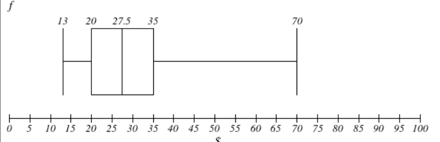
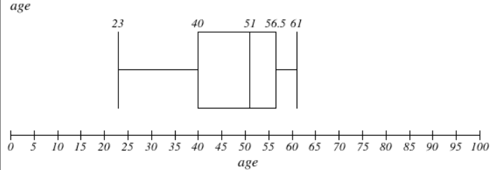
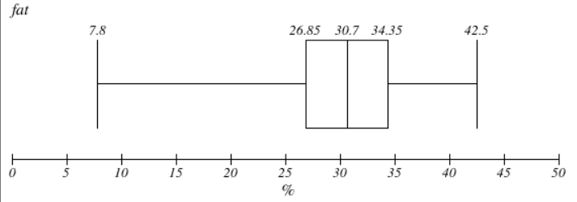
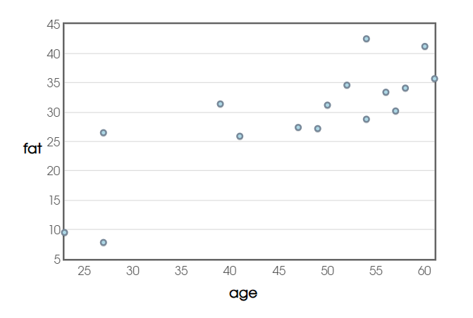
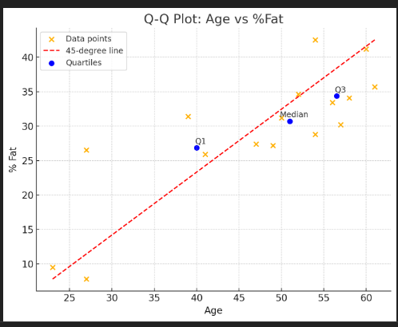

# CHAPTER 2. GETTING TO KNOW YOUR DATA 

### Introduction 

Questions to answer in this chapter:
  - What are the types of attributes or fields that make up your data?
  - What kind of values does each attribute have?
  - Which attributes are discrete, and which are continuous-valued?
  - What do the data look like?
  - How are the values distributed?
  - Are there ways we can visualize the data to get a better sense of it all?
  - Can we spot any outliers?
  - Can we measure the similarity of some data objects with respect to others?

### Data Objects and Attribute Types 

- **Data objects**: Represent entities (e.g., customers, patients) and are described by attributes (also known as samples, instances, or data points).
- **Attributes**: Characteristics or features of a data object. Also called dimensions, features, or variables.

_2.1.1 What Is an Attribute?_
- An attribute is a data field representing a characteristic of a data object.
- Examples: customer ID, name, address.
- **Attribute vector**: A set of attributes describing one object.

_2.1.2 Nominal Attributes_
- **Nominal**: Categorical attributes where values are names or labels without a meaningful order.
- Examples: Hair color (black, brown), marital status (single, married).
- **Mode**: The most common value for a nominal attribute.

_2.1.3 Binary Attributes_
- **Binary**: Nominal attributes with only two categories (e.g., 0 and 1).
- **Boolean**: A type of binary attribute with values true/false.
- Examples: Smoker (yes/no), gender (male/female).
- **Symmetric**: Both states have equal importance (e.g., gender).
- **Asymmetric**: States have different importance (e.g., medical test results).

_2.1.4 Ordinal Attributes_
- **Ordinal**: Attributes with a meaningful order, but without known magnitude differences between values.
- Examples: Drink size (small, medium, large), grades (A, B, C).
- **Median** and **Mode** can be calculated, but not the mean.

_2.1.5 Numeric Attributes_
- **Numeric**: Quantitative values, can be either:
  - **Interval-scaled**: Measured on a scale with equal-sized units, but no true zero (e.g., temperature in Celsius).
  - **Ratio-scaled**: Measurable values with a true zero point (e.g., weight, height).

_2.1.6 Discrete vs. Continuous Attributes_
- **Discrete**: A finite or countably infinite set of values (e.g., hair color, customer ID).
- **Continuous**: Numeric values that can take any value within a range (e.g., height, temperature).

### Basic Statistical Descriptions of Data

- **Goal**: To understand data and identify patterns, noise, or outliers.
- **Key Areas**:
  - **Central Tendency**: Measures where most values fall.
  - **Dispersion**: Measures how spread out the data is.
  - **Visualizations**: Graphical tools to inspect data distribution.

#### Central Tendency: Mean, Median, Mode

- **Mean (Average)**: 
  - The sum of all values divided by the number of values.
  - Sensitive to outliers, meaning extreme values can skew the mean significantly.
  
- **Median**: 
  - The middle value in a sorted list of data.
  - If the number of data points is odd, it is the exact middle; if even, it’s the average of the two middle values.
  - Less affected by outliers and skewed data.

- **Mode**:
  - The value(s) that appear most frequently in the dataset.
  - Data can be unimodal (one mode), bimodal (two modes), or multimodal (more than two modes).

- **Midrange**:
  - The average of the smallest and largest values in the dataset.
  - Provides a rough idea of the data's spread but is highly influenced by extreme values.

#### Dispersion: Range, Quartiles, Variance, Standard Deviation

- **Range**:
  - The difference between the highest and lowest values in the dataset.
  - Simple but doesn’t show how data is distributed between these extremes.

- **Quartiles**:
  - Divide the data into four equal parts.
  - **Q1 (25th percentile)**: 25% of data falls below this point.
  - **Q2 (50th percentile)**: The median; 50% of data falls below this.
  - **Q3 (75th percentile)**: 75% of data falls below this point.

- **Interquartile Range (IQR)**:
  - The range between Q1 and Q3 (middle 50% of the data).
  - A useful measure of spread because it ignores extreme values.

- **Variance**:
  - The average of the squared differences from the mean.
  - Measures how much the data points vary from the mean but is in squared units, making it harder to interpret directly.

- **Standard Deviation**:
  - The square root of the variance, providing a more interpretable measure of spread in the same units as the data.
  - A low standard deviation means data points are close to the mean, while a high standard deviation indicates data is more spread out.

#### Graphic Displays of Data

- **Quantile Plot**:
  - Shows the distribution of data by plotting each data point against its percentile rank.
  - Useful for identifying trends or unusual patterns in the data.

- **Q-Q Plot (Quantile-Quantile Plot)**:
  - Compares the quantiles of two datasets to see if they come from the same distribution.
  - A straight line indicates similar distributions; deviations from the line indicate differences.

- **Histograms**:
  - A graphical representation of the distribution of data using bars.
  - Each bar represents the frequency of data points within a specific range (bin).
  - Effective for showing the shape and spread of data distribution.

- **Scatter Plot**:
  - Displays the relationship between two variables by plotting data points on a two-dimensional grid.
  - Can reveal correlations: positive (both variables increase together) or negative (one increases while the other decreases).

### Data Visualization

- **Purpose**: To communicate data clearly through visual representations. It helps in identifying data relationships not easily visible in raw data.

#### Key Visualization Techniques

1. **Pixel-Oriented Techniques**:
   - Each dimension is represented by a pixel, with color reflecting the data value.
   - Multiple dimensions are shown as separate windows for each.
   - Useful for large datasets but limited in showing how dimensions relate spatially.

2. **Geometric Projection Techniques**:
   - Projects multidimensional data onto a 2D plane.
   - Common methods include scatter plots, where 2D data points are plotted, and scatter-plot matrices for higher dimensions.
   - Used to detect dense regions or correlations in the data.

3. **Icon-Based Techniques**:
   - Represents data using icons (e.g., faces or stick figures).
   - Each icon feature reflects a data attribute, allowing multiple dimensions to be visualized together.
   - Useful for seeing patterns but lacks precise data representation.

4. **Hierarchical Techniques**:
   - Organizes data into subsets and visualizes them hierarchically.
   - Examples include tree maps and methods like "Worlds-within-Worlds."
   - Efficient for visualizing complex, high-dimensional datasets.

#### Visualizing Complex Data

- **Text, Social Networks, and Other Non-Numeric Data**: New techniques, like tag clouds or graphs, help visualize these data types.
- **Complex Relations**: Tools like disease influence graphs visualize relationships between entities (e.g., correlations between diseases).

### Measuring Data Similarity and Dissimilarity

- **Purpose**: To determine how similar or different objects are, which is useful in tasks like clustering, outlier detection, and nearest-neighbor classification.

#### Key Concepts

1. **Similarity vs. Dissimilarity**:
   - **Similarity**: Measures how alike two objects are. A value of 1 indicates they are identical.
   - **Dissimilarity**: Measures how different two objects are. A value of 0 means objects are unalike, and a higher value means they are more similar.

#### Data Structures

1. **Data Matrix**:
   - Stores objects and their attributes in a table format (rows = objects, columns = attributes).

2. **Dissimilarity Matrix**:
   - Stores dissimilarity values for pairs of objects in an n × n table, where n is the number of objects.

#### Proximity Measures for Different Attribute Types

1. **Nominal Attributes**:
   - Use a ratio of mismatches between two objects' attribute states.
   - Similarity = 1 - Dissimilarity.

2. **Binary Attributes**:
   - **Symmetric**: Both 0 and 1 states are equally important.
   - **Asymmetric**: Focuses on 1's (positive matches) and ignores 0's (negative matches).

3. **Numeric Attributes**:
   - Use distance measures like:
     - **Euclidean Distance**: Measures the straight-line distance.
     - **Manhattan Distance**: Measures distance in terms of "blocks" or steps.
     - **Minkowski Distance**: A generalization of both Euclidean and Manhattan distances.

4. **Ordinal Attributes**:
   - Use ranks (e.g., 1st, 2nd, 3rd) and normalize them before calculating dissimilarity.

#### Handling Mixed Data Types

- Combine different types of attributes into a single dissimilarity matrix by scaling them to a common range (e.g., [0.0, 1.0]).

#### Cosine Similarity

- **Cosine Similarity**: Measures the cosine of the angle between two vectors, often used in text analysis and for high-dimensional, sparse data.
   - **Tanimoto Coefficient**: A variation of cosine similarity used for binary data or sets, focusing on shared attributes.

### Summary

- **Data Sets**:
  - Composed of **data objects** that represent entities.
  - Described by **attributes** that can be nominal, binary, ordinal, or numeric.

#### Attribute Types

- **Nominal Attributes**:
  - Represent categories or states (e.g., names, codes).
  
- **Binary Attributes**:
  - Two possible states (e.g., true/false or 1/0).
  - **Symmetric**: Both states are equally important.
  - **Asymmetric**: One state is more important than the other.
  
- **Ordinal Attributes**:
  - Values have a meaningful order but the difference between values is unknown.
  
- **Numeric Attributes**:
  - Quantitative and measurable.
  - **Interval-scaled**: Measured in equal units without a true zero-point.
  - **Ratio-scaled**: Has a true zero-point, allowing meaningful ratios.

#### Statistical Descriptions

- Used for data summarization:
  - **Central Tendency**: Mean, weighted mean, median, mode.
  - **Dispersion**: Range, quartiles, variance, standard deviation.

#### Data Visualization

- Techniques to display data:
  - **Pixel-oriented**, **geometric-based**, **icon-based**, or **hierarchical** methods.
  - Used to visualize both simple (e.g., relational data) and complex data (e.g., text, social networks).

#### Similarity and Dissimilarity

- **Measures of proximity** are used in clustering, outlier analysis, and classification.
  - **Jaccard coefficient** for asymmetric binary attributes.
  - **Euclidean, Manhattan, Minkowski**, and **Supremum distances** for numeric attributes.
  - **Cosine similarity** and **Tanimoto coefficient** for sparse numeric data vectors.

### Exercises

#### 2.1
Give three additional commonly used statistical measures that are not already illustrated in this chapter for the characterization of **data dispersion**. Discuss how they can be computed efficiently in large databases.

- **coefficient of range**: $\frac{H-S}{H+S}$
- **coefficient of variation**: $\left(\frac{\text{S.D.}}{\text{Mean}}\right) \times 100$
- **coefficient of mean deviation**: $\frac{\text{Mean Deviation}}{\bar{X}}$
- **coefficient of quartile deviation**: $\frac{Q_3-Q_1}{Q_3+Q_1}$

#### 2.2
Suppose that the data for analysis includes the attribute **age**. The age values for the data tuples are (in increasing order) 13, 15, 16, 16, 19, 20, 21, 22, 22, 25, 25, 25, 30, 33, 33, 35, 35, 35, 36, 40, 45, 46, 52, 70.

- (a) What is the **mean** of the data? What is the **median**?
  - **mean**: $31.6$
  - **median**: $27.5$
- (b) What is the **mode** of the data? Comment on the data’s modality (i.e., bimodal, trimodal, etc.).
  - the dataset is bimodal
  - the 2 modes of the dataset are $25$ and $35$ 
- (c) What is the **midrange** of the data?
  - the midrange of the dataset is $70 - 13 = 57$
- (d) Can you find (roughly) the first quartile ($Q_1$) and the third quartile ($Q_3$) of the data?
  - $Q_1$:
    - is the value where 25% of the data is below it 
    - since there are 24 data points, $25%$ of $24$ is $6$, so $Q_1=20$
  - $Q_3=35$
- (e) Give the **five-number summary** of the data.
  - _minimum_ (smallest individial observations): $13$
  - $Q_1$: $20$
  - median: $27.5$
  - $Q_3$: $35$
  - _maximum_ (largest individia observations): $70$
- (f) Show a **boxplot** of the data.
  - 
- (g) How is a **quantile–quantile plot** different from a **quantile plot**?
  - a quantile-plot shows the distribution of data by plotting each data point against its percentile rank and is useful for identifying trends or unusual patterns in the data
  - while the Q-Q plot compares the quantiles of two datasets to see if they come from the same distribution

#### 2.3
Suppose that the values for a given set of data are grouped into intervals. The intervals and corresponding frequencies are as follows:

| age   | frequency |
|-------|-----------|
| 1–5   | 200       |
| 6–15  | 450       |
| 16–20 | 300       |
| 21–50 | 1500      |
| 51–80 | 700       |
| 81–110| 44        |

Compute an **approximate median** value for the data

- the formula for approximating the median when we have a large number of observations (numeric attributes):
  - $L_1$: the **lower boundary** of the interval containing the median
  - $N$: the total number of data points
  - $\sum freq_l$: the **sum of frequencies** for all intervals **below** the median interval
  - $freq_{median}$: the frequency of the median interval
  - **width**: the width of the median interval (difference between the upper and lower bounds of the median interval)
  - _solution_:
    - calculate $N = 3194$
    - the median (middle position) $= 1597$
    - find the interval that contains this 1597th value by summing frequencies: $200 + 650 + 950 + 2450$, the 1597th value falls in the 4th interval (21-50), so this is the **median interval**
    - apply the formula
      - $L_1 = 21$
      - $\frac{N}{2} = 1597$
      - $\sum freq_l = 950$ (the sum of frequencies for all intervals below the median interval)
      - $freq_{median} = 1500$ (the frequency of the median interval)
      - width $= 50 - 21 = 29$ $\rightarrow$ median = approx. 33.51
           
#### 2.4
Suppose that a hospital tested the age and body fat data for 18 randomly selected adults with the following results:

| age   | 23   | 27   | 27   | 39   | 41   | 47   | 49   | 50   |
|-------|------|------|------|------|------|------|------|------|
| %fat  | 9.5  | 26.5 | 7.8  | 31.4 | 25.9 | 27.4 | 27.2 | 31.2 |
| age   | 52   | 54   | 54   | 56   | 57   | 58   | 60   | 61   |
| %fat  | 34.6 | 42.5 | 28.8 | 33.4 | 30.2 | 34.1 | 41.2 | 35.7 |

- (a) Calculate the **mean**, **median**, and **standard deviation** of **age** and **%fat**.
  - break down of the variance formula
    - $N$: the total number of data points
    - $x_i$: each individual data points
    - $\bar{x}$: the mean of the data points
  - the **standard deviation** is just the square root of the variance

|                    | age   | fat   |
|--------------------|-------|-------|
| mean               | 47.19 | 29.21 |
| median             | 51    | 30.7  |
| standard deviation | 11.93 | 9.15  |

- (b) Draw the **boxplots** for **age** and **%fat**.

  - 
  
  - 

- (c) Draw a **scatter plot** and a **q-q plot** based on these two variables.

  - 
 
  - 

#### 2.5
Briefly outline how to compute the dissimilarity between objects described by the following:

- (a) **Nominal attributes**: the dissimilarity between 2 objects $i$ and j$j can be computed based on the ratio of mismatches $d(i,j)=\frac{p-m}{p}$
  - $m$ is the number of matches
  - $p$ is the total number of attributes describing the objects
  - weights can be assigned to increase the effect of $m$ to assign greater weight to matches in attributes having a larger number of states  
- (b) **Asymmetric binary attributes**: $d(i,j) = \frac{r + s}{q + r + s}$
  - $r$ is the number of attributes that equal $1$ for object $i$ but equal $0$ for object $j$
  - $s$ is the number of attributes that equal $0$ for object $i$ but equal $1$ for object $j$
  - $t$ is the number of attributes that equal $0$ for both objects $i$ and $j$
  - $q$ is the number of attributes that equal $1$ for both objects $i$ and $j$
  - $p$ is the ttal number of attributes, where $p = q + r + s + t$
- (c) **Numeric attributes**: the most popular distance measure is **Eucledian distance**. Let $i = (x_{i1}, x_{i2},...,x_{ip})$ and $j = (x_{j1}, x_{j2},..., x_{jp})$ be 2 objects described by $p$ numeric attributes. The Eucledian distance distance between objects $i$ and $j$ is defined as $d(i, j) = \sqrt{(x_{i1} - x_{j1})^2 + (x_{i2} - x_{j2})^2 + \dots + (x_{ip} - x_{jp})^2}$
- (d) **Term-frequency vectors**: we can use **Cosine similarity**: $sim(x, y) = \frac{x \cdot y}{\|\|x\|\| \|\|y\|\|}$
  - $\|\|x\|\|$is the Eucledian norm of vector $x$
  - a cosine value of $0$ means that the 2 vectors are at 90 degrees to each other and have no match
  - the closer the cosine value to $1$, the smaller the angle and the greater the match between vectors 

#### 2.6
Given two objects represented by the tuples (22, 1, 42, 10) and (20, 0, 36, 8):

- (a) Compute the **Euclidean distance** between the two objects: $6.7$
- (b) Compute the **Manhattan distance** between the two objects: $45$  
- (c) Compute the **Minkowski distance** between the two objects, using q = 3: $6.15$ 
- (d) Compute the **supremum distance** between the two objects: $6$

#### 2.7
The **median** is one of the most important holistic measures in data analysis. Propose several methods for **median approximation**. Analyze their respective complexity under different parameter settings and decide to what extent the real value can be approximated. Moreover, suggest a heuristic strategy to balance between accuracy and complexity and then apply it to all methods you have given.

#### 2.8
It is important to define or select similarity measures in data analysis. However, there is no commonly accepted subjective similarity measure. Results can vary depending on the similarity measures used. Nonetheless, seemingly different similarity measures may be equivalent after some transformation.

Suppose we have the following 2-D data set:

|    | A1   | A2   |
|----|------|------|
| x1 | 1.5  | 1.7  |
| x2 | 2    | 1.9  |
| x3 | 1.6  | 1.8  |
| x4 | 1.2  | 1.5  |
| x5 | 1.5  | 1.0  |

- (a) Consider the data as 2-D data points. Given a new data point, x = (1.4, 1.6) as a query, rank the database points based on similarity with the query using **Euclidean distance**, **Manhattan distance**, **supremum distance**, and **cosine similarity**.
- (b) Normalize the data set to make the norm of each data point equal to 1. Use **Euclidean distance** on the transformed data to rank the data points.

### Questions 

- _How they can be computed efficiently in large databases?_ (exercise 2.1)
- 

### Linkie 
- the chapter starts on page 76
- exercise 2.1 [reference](https://www.cuemath.com/data/measures-of-dispersion/)
- the [link](https://www.imathas.com/stattools/boxplot.html) I used to draw the boxplot
- [scatterplot](https://stats.blue/Stats_Suite/scatter_plot_maker.html) link
- standard deviation [calculator](https://www.calculator.net/standard-deviation-calculator.html?numberinputs=23%2C+27%2C+27%2C+39%2C+41%2C+47%2C+49%2C+50%2C+52%2C+54%2C+54%2C+56%2C+57%2C+58%2C+60%2C+61&ctype=p&x=Calculate)
- github markdown [table generator](https://www.tablesgenerator.com/markdown_tables#google_vignette)
- [ ] exercise [2.8](https://www.youtube.com/watch?v=PzbZ52gy8Bc)
- 
